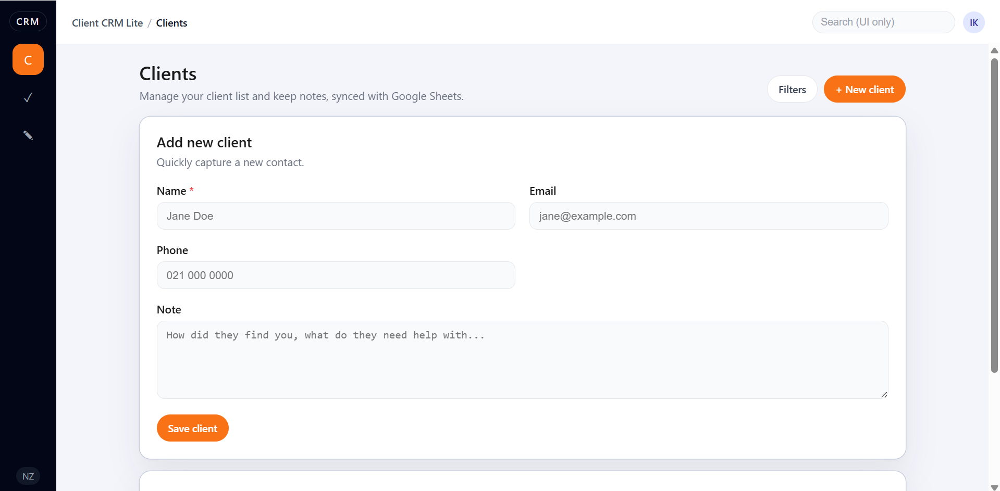
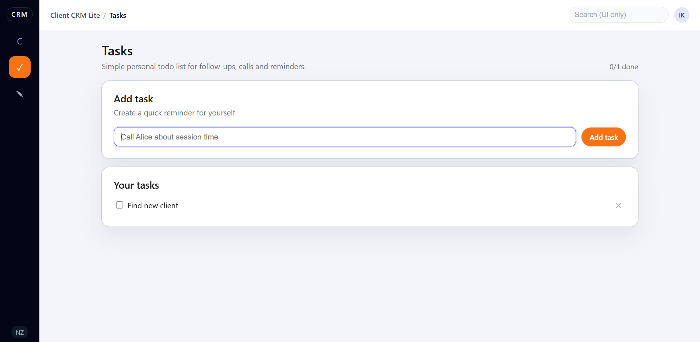
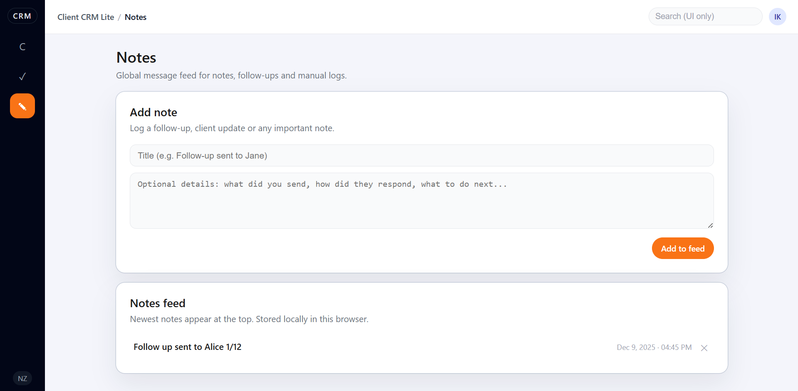

# Client CRM Lite

_A lightweight, realistic mini-CRM for small service businesses (coaches, beauty studios, trainers) with a clean SaaS-style UI and Google Sheets as the “database”._

---

## What this project is

Client CRM Lite is a small but real full-stack app:

- **Front-end:** React + TypeScript, modern orange SaaS UI
- **Back-end:** Node.js + Express + TypeScript
- **Storage:** Google Sheets via a service account (no custom DB)

It’s designed for **small businesses** who currently live in spreadsheets and DMs and just want something slightly smarter – but not a full enterprise CRM.

## Google Sheets Integration

This CRM is fully integrated with **Google Sheets**, which acts as a lightweight cloud database.

All client records are:

- stored inside a live Google Sheet,
- synced through a custom Node/Express API,
- automatically loaded into the UI on startup,
- persisted across sessions with no data loss.

When a new client is created in the interface, the backend writes a new row into the sheet.  
When the application loads, it fetches the most recent data back.

This approach keeps the system simple, transparent, and ideal for small businesses who already rely on spreadsheets — while still providing a clean, SaaS-style CRM experience.

## Features

### 1. Clients – synced with Google Sheets

- View all clients in a clean table:
  - **Name**, **Email**, **Phone**, **Note**, **Last contacted**
- Add new clients via a simple form:
  - Required: **Name**
  - Optional: Email, Phone, Note
- Data flow:
  - Front-end sends `POST /clients`
  - Node/Express API writes a new row to **Google Sheets**
  - API returns the created client, which is appended to the UI

> Client data is **persistent** – everything lives in Google Sheets, not in memory.

## 

### 2. Tasks – simple todo list for follow-ups

- A personal **Tasks** page for:
  - follow-ups,
  - calls,
  - “remember to message this client”.
- Features:
  - Add a task via a one-line input
  - Mark tasks as done / not done (checkbox)
  - Remove tasks
  - Small counter: `X/Y done`

> Tasks are stored in React state only (MVP) – ideal for demoing state management and UI logic.

## 

### 3. Notes – global message / notes feed

The **Messages (Notes)** page acts as a simple **activity log**:

- Add a note with:
  - **Title** (e.g. “Follow-up sent to Jane”)
  - **Body** (e.g. “Sent pricing and availability, waiting for reply”)
- Each entry shows:
  - Title
  - Body (optional)
  - **Date + time** (formatted from `createdAt`)
- New entries appear at the **top** of the feed
- Notes can be removed

> This mimics how many CRMs handle internal notes / activity without needing real email or chat integrations.

## 

### 4. Modern SaaS layout & UX

- **Left sidebar** (Freshdesk / Linear inspired):
  - `C` – Clients
  - `✓` – Tasks
  - `✎` – Notes
  - Active item highlighted with a warm orange accent
- **Topbar**:
  - App name + current section (`Client CRM Lite / Clients|Tasks|Notes`)
  - Placeholder search field (UI only)
  - Simple avatar with initials
- **Content area**:
  - Page header (title + subtitle + actions)
  - Clean card layout:
    - one card for forms,
    - one card for lists/tables

Colour theme: warm orange SaaS palette (primary, hover, subtle orange accents).

---

## Tech stack

**Front-end**

- React (Vite)
- TypeScript
- Fetch API for HTTP calls
- Component-based pages:
  - `ClientsPage`
  - `TasksPage`
  - `MessagesPage`
- Simple shell layout (sidebar + topbar + content)

**Back-end**

- Node.js
- Express
- TypeScript
- `googleapis` (Google Sheets API)
- `dotenv`, `cors`, `ts-node-dev`

**Storage**

- **Google Sheets** as the backing store for clients:
  - One sheet with header row
  - Rows represent clients
- Tasks and Notes – stored in React state (easy to extend later to Sheets/localStorage).

---

## Project structure

```text
crm-lite/
  client/                    # React + TypeScript front-end
    src/
      App.tsx               # Layout shell + navigation + state
      App.css               # SaaS UI styles (sidebar, topbar, cards)
      index.css             # Global reset & typography
      main.tsx              # React entrypoint
      pages/
        ClientsPage.tsx     # Clients page (form + table)
        TasksPage.tsx       # Tasks (todo list)
        MessagesPage.tsx    # Global notes/message feed
    package.json
    vite.config.ts

  server/                    # Node + Express + TypeScript API
    src/
      index.ts              # Express app, /clients routes
      googleSheets.ts       # Google Sheets integration
      types.ts              # Shared types (Client)
    .env
    service-account-key.json (ignored in git)
    package.json
    tsconfig.json
```

---

## Future Improvements

Link notes to specific clients

Persist tasks and notes to Google Sheets

Add search and filtering

Add client tags and categories

Add authentication

Deploy client + server

---

## Running the project

Start backend:

```bash
cd server
npm install
npm run dev
```

Start frontend:

```bash
cd client
npm install
npm run dev
```

---

### Author

Built by Irina Kostina — Full-stack Developer based in New Zealand

---

### License

This project is not licensed for reuse.  
All rights reserved.

---
